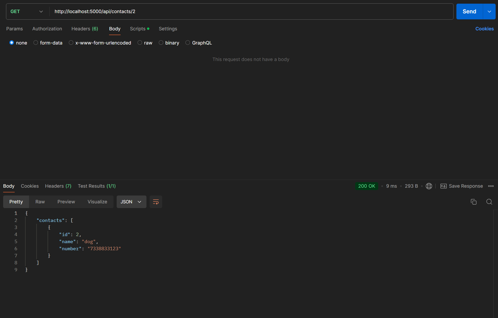

# Contacts_REST_API

A RESTful API built with Node.js and Express for managing contacts. It supports CRUD operations and utilizes MySQL for data storage. 

I ran MySQL in a Docker container, made use of Docker volumes to ensure data persists even after the container is stopped or removed.

Used POSTMAN to test the API.

This API only runs locally for now 😭😭😭, I plan to host the database and the API in the future if I decide to proceed with deployment.

Steps to run the API given below.

## API Endpoints
<p align="center">
  
</p>

## Working Screenshots

### GET (All Contacts)
<p align="center">
  
</p>

### GET (Contact By ID)
<p align="center">
  
</p>


### POST ( Create Contact)
<p align="center">
  
</p>

### PUT ( Update Contact)
<p align="center">
  
</p>

### DELETE (Delete Contact by id)
<p align="center">
  
</p>

## How To Use The API

**To run the API locally, follow these steps:**

1. **Clone the Repository**

   ```bash
   git clone https://github.com/your-username/contacts-api.git
   cd contacts-api

2. **Install Dependencies**

   ```bash
    npm install

3. **Create Database contacts(In MYSQL)** 

   ```bash
   CREATE DATABASE contacts

3. **Create Table Contacts (IN MYSQL)**
   ```bash
   USE contacts;
    CREATE TABLE Contacts (
    id INT PRIMARY KEY,
    name VARCHAR(255) NOT NULL,
    number VARCHAR(15) NOT NULL
    );

4. **Change MYSQL_PASSWORD To Your Password In The Dotenv File**

5. **Start The Application**
   ```bash
    npm start
6. **Test The API Via POSTMAN / OPENAPI**
